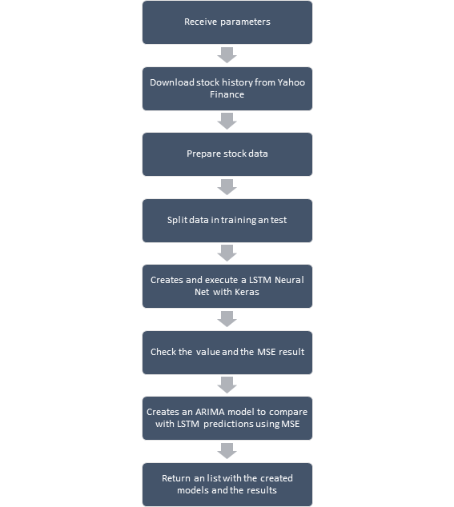

```{r setup, include=FALSE}
knitr::opts_chunk$set(echo = TRUE)
```

## Introduction

This method creates a LSTM neural net capable of predict a stock time series using Keras.

I wrote about LSTM and time series on [this article](https://rpubs.com/marcosmhs/rede_lstm_predicao_dolar) in RPubs site.

The code of the method could be downloaded on my [Github](https://github.com/marcosmhs/LSTM-Stock-prediction-function).

## Execution steps

The method structure could be resumed in the image bellow



## Code Examples

Method creation:

```{r method creation}
source('../lstm_stock_function.R')
```

On a first example I with use META (Facebook, WhatsApp, Instagram, etc) stocks and for now I don´t need a ARIMA comparison

```{r first example, message=FALSE, warning=FALSE, paged.print=TRUE}
return_meta <- 
    lstm_stock(
      stock_name = 'META', 
      start_date = '2019-01-01', 
      lstm_executions = 10, 
      lstm_verbose = F)

```

On a second example the lstm_stock will use data from Petrobrás (brazilian oil company). The data will be extract from Bovespa (brazilian stock market) from 2015 until today. The method will execute a LSTM neural net with 10 iterations and in the end will also execute and ARIMA model to compare the results

```{r code example, message=FALSE, warning=FALSE}
return_petr4 <- 
    lstm_stock(
      origin = '^BVSP', 
      stock_name = 'PETR4.SA', 
      start_date = '2015-01-01', 
      lstm_executions = 10, 
      arima_compare = T,
      lstm_verbose = F)
```

As we can see, on this example, the ARIMA model was capable to make a better prediction comparing with the LSTM model.

To end this text, if you find some bug or "brain cramp" please e-mail me on marcosmhs\@live.com and I will be glad on correct the code and register your name on the credits.
